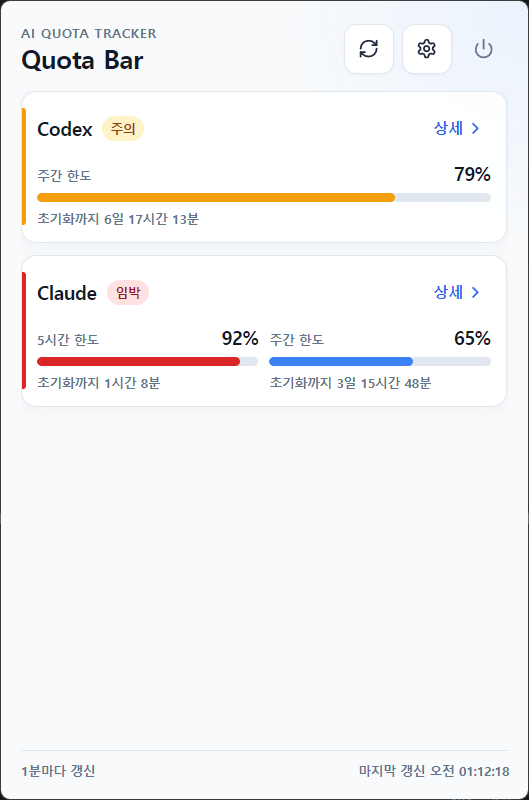
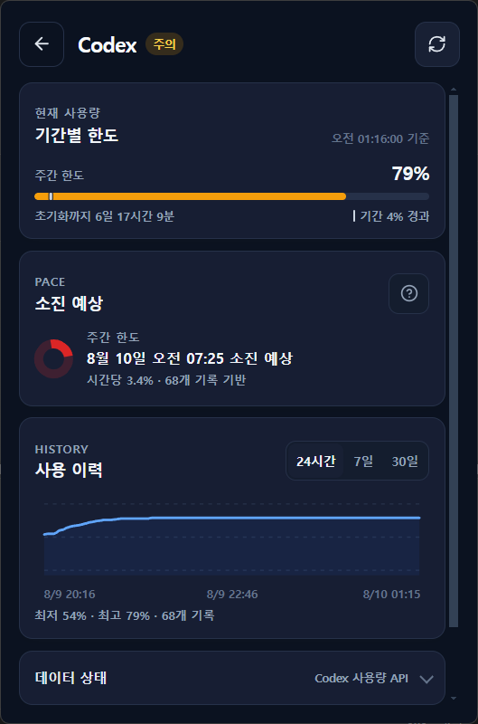
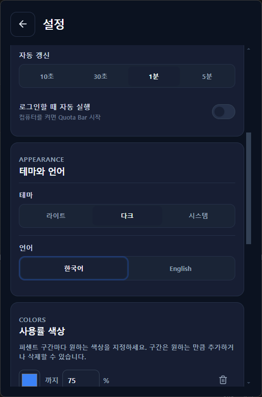
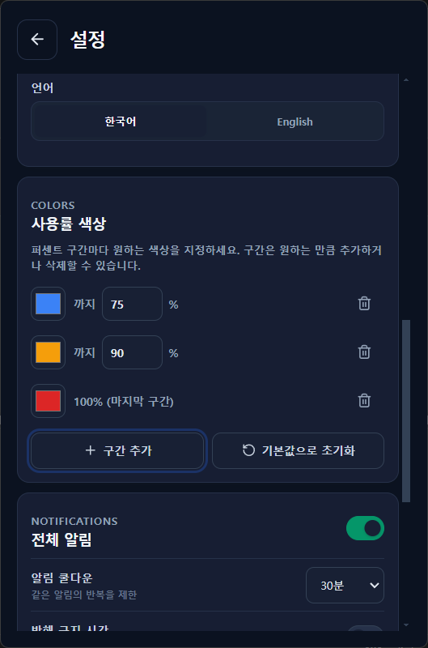
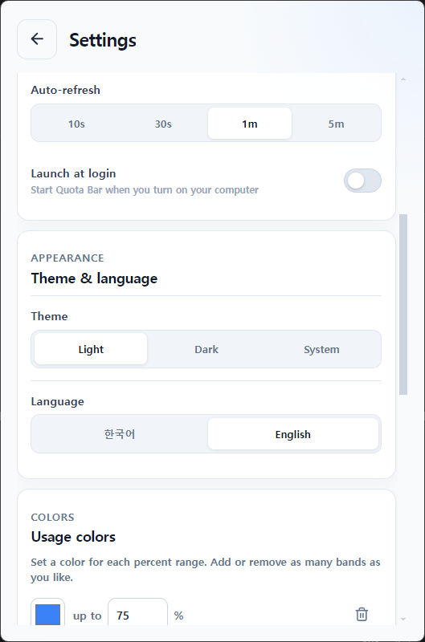

# Quota Bar

*[한국어](README.md) | English*

A tray widget that shows your Codex, Claude, and Gemini usage right from the macOS menu bar, Windows system tray, or Linux top bar.


## Key features

- Check usage at a glance from the tray/menu bar icon; clicking it opens a clean per-provider summary
- The `Details` view shows the period-elapsed line, burn rate, projected exhaustion time, and 24h/7d/30d history
- See the data source, the actual observation time, cache/retry status, and the official Claude/OpenAI service status
- Choose a refresh interval of 10s/30s/1m/5m; Codex/Claude API calls respect a 60s minimum interval and the server's retry timing
- Turn each AI provider on or off as you like
- Shows usage per period (e.g. 5-hour/weekly) and the time remaining until reset
- Per-provider 75%/90%/100% and projected-exhaustion alerts, plus real 0% reset notifications with cooldown and quiet hours
- 30 days of local usage history kept separate from credentials, and diagnostics you can copy without exposing personal data
- Per-provider sign-in/sign-out
- Optional launch at login (only supported in the installed app, not in `npm run dev`)
- Light/dark/system theme, selectable in Settings
- Korean/English language, selectable in Settings — covers the whole UI, including the tray menu, notifications, and per-provider status/error messages
- Auto-update on Windows/Linux via GitHub Releases (with a manual "Check for updates" button in Settings > Updates). macOS doesn't support auto-update yet, pending code signing/notarization
- Set the usage bar/card colors per percent range yourself — add or remove as many bands as you like and pick each one's color with a color picker

## Screens

| | |
| --- | --- |
|  Overview — dark theme |  Overview — light theme; 92% is a user-defined red band |
|  Provider detail — limits, projected exhaustion, history, data status |  Settings — light/dark/system theme, Korean/English language |
|  Settings — freely add/remove usage color bands |  The whole UI translates when English is selected, including the tray menu and notifications |

## How usage analysis works

Quota Bar does not count tokens or requests on its own. It collects the **per-period usage percentage** returned by local CLI records or provider usage APIs, and computes local history and burn trends without mixing accounts or limit windows that carry identifying information. Real usage analysis currently applies to Codex and Claude; Gemini has no stable official quota source, so only its sign-in status is detected. In the app's provider detail view, tapping the `?` button next to `Projected exhaustion` shows a summary of how this works.

### Data source and freshness

- `Local session` means rate-limit records saved by the CLI, `Provider usage API` means a usage response returned by the service, and `Showing cache` means the last healthy value kept during a temporary lookup failure.
- `Observed at source` is when the provider or local record measured the usage, and `Received by app` is when Quota Bar received that value. Even if the screen just refreshed, a stale observation time can mean recent usage hasn't been reflected yet.
- Error/signed-out/unavailable values and stale cache are never used as the basis for new history points, exhaustion projections, or usage alerts. The `Accurate` label means the app used the local record or API value as-is — it does not mean Quota Bar independently verified the provider's billing records.

### Local history

- Only usable 0–100% observations that aren't errors, sign-outs, or stale cache are stored in the app's `usage-history.json`. Tokens, account labels, error messages, and local file paths are never stored.
- A new point is recorded whenever the usage percentage, reset time, or data quality changes; if the value stays the same, it's recorded at most once every 5 minutes.
- The most recent 24 hours keep raw points. The 1–7 day range is compressed to 30-minute buckets and the 7–30 day range to 2-hour buckets, each bucket preserving its first, min, max, and last value. Points older than 30 days are deleted, and the overall cap is 50,000 points.
- Below the chart, the start, time-midpoint, and end of the actually rendered history are shown. `24h` prefers a time-of-day label, while `7d`/`30d` prefer a date label, adding whatever extra date context is needed across midnight or year boundaries.

### Burn rate and projections

- Only records that share the same provider, identified account, limit window, and reset cycle are grouped in time order, and a least-squares linear regression over usage vs. time gives the `hourly burn rate`. A downward-trending slope is treated as 0. If a provider doesn't supply account or reset identifying information, that range can't be fully isolated.
- Calculation starts once at least 2 records span 5+ minutes. If the current value and history are both accurate, there are 4+ records, and the observation window is 30+ minutes, confidence is shown as high; otherwise, or if estimated values are mixed in, confidence is shown as low. Before those conditions are met, no number is fabricated — it shows `Learning` instead.
- `Projected usage at reset` is computed as `current usage + hourly burn rate × time remaining until reset`, capped at 100%. If the reset time is known, `Projected exhaustion time` is only shown when 100% would be reached before then; without a known reset time, it's estimated purely from the current upward trend.
- The vertical line on the usage bar is the **elapsed ratio of the current period**, computed from the reset time and limit length. If the usage bar is ahead of the line, you're burning through the limit faster than time is elapsing.

### Alerts and service status

- Threshold alerts don't fire on the very first observation — they only fire when the previous healthy value was below the configured threshold and a new one crosses above it. If multiple thresholds are crossed at once, only the highest one is notified.
- Reset alerts only fire when a healthy response for the same account/limit window shows usage change from `above 0% → 0%`. A first observation of 0%, and error/signed-out/cache values, are never treated as a reset.
- Projected-exhaustion alerts fire once per period when a computable trend shows 100% would be reached before the reset time. Threshold and projected-exhaustion alerts, if conditions still hold, are delivered right after the cooldown ends, but real 0%-reset alerts are never subject to cooldown.
- Events that occur while notifications are off or during quiet hours are not replayed later in a batch. The evaluation baseline is kept for the life of the running app; restarting the app resets the baseline to the first healthy observation.
- Codex is checked against the Codex component of the OpenAI status page, and Claude against the Claude Code/Claude API components, every 5 minutes. If a new check fails, the last healthy status is kept; if there has never been a successful check, it shows `Status unavailable`. Gemini has no exactly matching official CLI status component, so it always shows `Status unavailable`. This public status is not a diagnosis of any particular account's sign-in or quota issue.

> Projected exhaustion is a reference value based on a straight-line trend of recent usage. It cannot account for prompt size, model changes, parallel work, or provider aggregation delays or plan changes ahead of time, so it does not guarantee the actual exhaustion time.

## Signing in

1. Turn on the toggle for each model you want to show.
2. For Codex and Claude, signing in from each CLI (`codex login`, or `/login` inside Claude Code) lets the app automatically find and connect the session. Codex also lets you paste a token directly into its card if needed.
3. Gemini automatically detects a `gemini` CLI sign-in session.
4. Already-connected providers show a `Log out` button in the same spot.

Sign-in state is re-detected from each CLI's saved session, so it persists across app restarts. Settings entered directly in the app are also preserved. For more detail on how things work internally (local session detection paths, per-period usage calculation, etc.), see [FEATURES.md](FEATURES.md).

## Install and run

Grab the installer for your OS from the [Releases page](https://github.com/apg0001/AI_Agent_Usage_Widget_for_MAC/releases/latest) and install it directly (Windows: `Quota Bar Setup *.exe`, or the portable `Quota Bar *.exe`). On Windows/Linux, the app checks for and offers new versions automatically from Settings > Updates after install.

To run or build it yourself instead, clone the repo and start it in dev mode.

```bash
git clone https://github.com/apg0001/AI_Agent_Usage_Widget_for_MAC.git
cd AI_Agent_Usage_Widget_for_MAC
npm install
npm run dev
```

## Building release artifacts

Run the command for your OS. Building macOS artifacts on macOS and Windows/Linux artifacts on their own OS is recommended, due to platform-specific tooling (code signing, NSIS, AppImage, etc.).

| OS | Command | Output location |
| --- | --- | --- |
| macOS | `npm run package:mac` | `dist/Quota Bar-*.dmg`, `dist/Quota Bar-*-mac.zip` |
| Windows | `npm run package:win` | `dist/Quota Bar Setup *.exe` (installer), `dist/Quota Bar *.exe` (portable) |
| Linux | `npm run package:linux` | `dist/*.AppImage`, `dist/*.deb` |

Before building, you can verify the repo is in a clean, working state with `npm run verify` (runs type checking, linting, tests, and the build in order). For more detailed procedures and troubleshooting, see [HARNESS.md](HARNESS.md).

## Suggesting changes

If there's something you'd like fixed or a feature you'd like added, let us know via an [issue](https://github.com/apg0001/AI_Agent_Usage_Widget_for_MAC/issues) or send a PR. When sending a PR, please follow the branch/commit conventions in [CONTRIBUTING.md](CONTRIBUTING.md).

## Further reading

- [FEATURES.md](FEATURES.md) — how sign-in/usage detection works internally
- [HARNESS.md](HARNESS.md) — per-platform verification/packaging procedures, troubleshooting
- [CONTRIBUTING.md](CONTRIBUTING.md) — how to contribute, branch/commit conventions, roadmap
