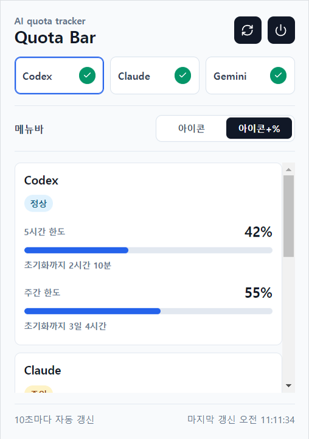

# Quota Bar

macOS 메뉴바, Windows 시스템 트레이, Linux 상단바에서 Codex, Claude, Gemini 사용량을 바로 확인할 수 있는 트레이 위젯입니다.



## 주요 기능

- 트레이/메뉴바 아이콘에서 바로 사용량 확인, 클릭하면 깔끔한 제공자별 요약 표시
- `상세` 화면에서 기간 경과선, 소진 속도·예상 소진 시각, 최근 24시간·7일·30일 이력 확인
- 데이터 출처, 실제 관측 시각, 캐시·재시도 상태와 Claude/OpenAI 공식 서비스 상태 확인
- 화면 갱신 주기를 10초·30초·1분·5분 중 선택하고 Codex/Claude API는 최소 60초 간격 및 서버의 재시도 시간을 준수
- 표시할 AI 제공자를 원하는 대로 켜고 끄기
- 5시간/주간 등 기간별 사용량과 초기화까지 남은 시간 표시
- 제공자별 75%·90%·100%, 예상 소진, 실제 0% 초기화 알림과 쿨다운·방해 금지 설정
- 인증정보와 분리된 30일 로컬 사용 이력, 개인정보를 제외한 진단 정보 복사
- 제공자별 로그인/로그아웃
- 컴퓨터 켤 때 자동 실행 옵션(설치된 앱에서만 지원, `npm run dev` 개발 실행에서는 동작하지 않음)

## 사용량 분석 방식

Quota Bar는 토큰이나 요청 수를 자체적으로 세지 않습니다. 로컬 CLI 기록 또는 제공자 사용량 API가 돌려준 **기간별 사용률(%)**을 수집하고, 식별 정보가 있는 계정과 한도 구간을 서로 섞지 않은 채 로컬 이력과 소진 추세를 계산합니다. 현재 실제 사용률 분석은 Codex와 Claude에 적용되며, 안정적인 공식 할당량 소스가 없는 Gemini는 로그인 상태만 감지합니다. 앱의 제공자 상세 화면에서 `소진 예상` 옆 `?` 버튼을 누르면 아래 방식의 요약 설명을 바로 볼 수 있습니다.

### 데이터 출처와 신선도

- `로컬 세션`은 CLI가 저장한 rate-limit 기록, `제공자 사용량 API`는 서비스가 반환한 사용량 응답, `캐시 표시 중`은 일시적인 조회 실패 때 유지한 마지막 정상 값을 뜻합니다.
- `원본 관측`은 제공자나 로컬 기록이 사용량을 측정한 시각이고, `앱 수신`은 Quota Bar가 그 값을 받은 시각입니다. 화면을 방금 갱신했더라도 원본 관측 시각이 오래됐다면 최신 사용이 아직 반영되지 않았을 수 있습니다.
- 오류·미로그인·사용 불가 값과 오래된 캐시는 새 이력, 소진 예측, 사용량 알림의 근거로 사용하지 않습니다. 화면의 `정확` 표시는 로컬 기록이나 API 값을 그대로 사용했다는 뜻이며, Quota Bar가 제공자의 과금 내역을 독립적으로 검증했다는 뜻은 아닙니다.

### 로컬 이력

- 오류·로그아웃·오래된 캐시가 아닌 0~100%의 사용 가능한 관측값만 앱의 `usage-history.json`에 저장합니다. 토큰, 계정 라벨, 오류 메시지와 로컬 파일 경로는 저장하지 않습니다.
- 사용률·초기화 시각·데이터 품질이 바뀌면 새 점을 기록하고, 값이 그대로면 5분마다 한 번만 기록합니다.
- 최근 24시간은 원본 점을 유지합니다. 1~7일 구간은 30분, 7~30일 구간은 2시간 단위로 압축하되 각 구간의 첫값·최솟값·최댓값·마지막값을 보존합니다. 30일보다 오래된 점은 삭제하며 전체 상한은 50,000개입니다.
- 그래프 아래에는 실제로 그려진 기록의 시작·시간상 중앙·끝을 표시합니다. `24시간`은 시각, `7일·30일`은 날짜를 우선 표시하고 자정이나 연도 경계에서는 필요한 날짜 정보를 자동으로 보강합니다.

### 소진 속도와 예상치

- 같은 제공자·식별된 계정·한도 구간·초기화 주기의 기록만 시간순으로 묶고, 사용률과 시간의 관계에 최소제곱 선형 회귀를 적용해 `시간당 소진율`을 계산합니다. 사용률이 감소하는 방향의 기울기는 0으로 처리합니다. 제공자가 계정이나 초기화 식별 정보를 주지 않으면 해당 범위를 완전히 분리할 수 없습니다.
- 최소 2개 기록이 5분 이상에 걸쳐 쌓여야 계산을 시작합니다. 현재 값과 이력이 모두 정확하고 기록이 4개 이상이며 관측 기간이 30분 이상이면 신뢰도를 높게 보고, 그 전이나 추정값이 섞인 경우에는 낮은 신뢰도로 표시합니다. 조건을 채우기 전에는 숫자를 만들지 않고 `학습 중`으로 표시합니다.
- `초기화 시 예상 사용률`은 `현재 사용률 + 시간당 소진율 × 초기화까지 남은 시간`으로 계산하고 100%를 상한으로 둡니다. 초기화 시각을 아는 경우에는 그 전에 100%에 도달할 때만 `예상 소진 시각`을 표시하며, 초기화 시각이 없으면 현재 증가 추세만으로 추정합니다.
- 사용량 막대의 세로선은 초기화 시각과 한도 길이로 계산한 **현재 기간 경과율**입니다. 사용률 막대가 세로선보다 앞서 있으면 시간 경과보다 빠르게 한도를 쓰고 있다는 뜻입니다.

### 알림과 서비스 상태

- 임계치 알림은 첫 관측부터 울리지 않고, 이전 정상 값이 설정한 임계치 미만이었다가 이상으로 올라갈 때만 발생합니다. 한 번에 여러 임계치를 넘으면 가장 높은 단계만 알립니다.
- 초기화 알림은 같은 계정·한도 구간의 정상 응답에서 사용률이 `0% 초과 → 0%`로 바뀔 때만 발생합니다. 첫 관측이 0%인 경우와 오류·미로그인·캐시 값은 초기화로 판정하지 않습니다.
- 예상 소진 알림은 계산 가능한 추세에서 100% 도달 시각이 초기화보다 빠를 때 주기당 한 번 발생합니다. 임계치·예상 소진 알림은 쿨다운 중에도 조건이 유지되면 쿨다운 뒤 전달하지만, 실제 0% 초기화 알림은 쿨다운을 적용하지 않습니다.
- 알림을 꺼 두거나 방해 금지 시간에 지나간 이벤트는 나중에 몰아서 재생하지 않습니다. 판정 기준은 앱 실행 중 유지되며, 앱을 다시 시작하면 첫 정상 관측값부터 새 기준을 잡습니다.
- Codex는 OpenAI 상태 페이지의 Codex 컴포넌트, Claude는 Claude Code·Claude API 관련 컴포넌트를 5분 간격으로 확인합니다. 새 조회가 실패하면 마지막 정상 상태를 유지하고, 정상 조회가 한 번도 없으면 `상태 확인 불가`로 표시합니다. Gemini는 정확히 대응되는 공식 CLI 상태 컴포넌트가 없어 `상태 확인 불가`로 표시합니다. 이 공개 상태는 특정 계정의 로그인이나 할당량 문제를 진단하는 값이 아닙니다.

> 소진 예상은 최근 사용 패턴을 직선 추세로 본 참고값입니다. 프롬프트 크기, 모델 변경, 병렬 작업, 제공자의 집계 지연이나 요금제 변경을 미리 알 수 없으므로 실제 소진 시각을 보장하지 않습니다.

## 로그인

1. 표시하고 싶은 모델 토글을 켭니다.
2. Codex, Claude는 각 CLI에서 로그인해두면(`codex login`, Claude Code 안에서 `/login`) 앱이 자동으로 세션을 찾아 연결합니다. Codex는 필요하면 카드에 직접 토큰을 넣을 수도 있습니다.
3. Gemini는 `gemini` CLI 로그인 세션을 자동 감지합니다.
4. 이미 연결된 항목은 같은 자리에 `로그아웃` 버튼이 나타납니다.

로그인 상태는 각 CLI가 저장한 세션을 다시 감지하므로 앱을 다시 실행해도 유지됩니다. 앱에 직접 입력한 설정도 보존됩니다. 더 자세한 동작 방식(로컬 세션 감지 경로, 기간별 사용량 계산 등)은 [FEATURES.md](FEATURES.md)를 참고하세요.

## 설치 및 실행

아직 별도로 배포되는 설치 파일은 없어서, 저장소를 받아 직접 실행하거나 빌드해야 합니다.

```bash
git clone https://github.com/apg0001/AI_Agent_Usage_Widget_for_MAC.git
cd AI_Agent_Usage_Widget_for_MAC
npm install
npm run dev
```

## 배포 파일 만들기

내 운영체제에 맞는 명령을 실행하면 됩니다. macOS 산출물은 macOS에서, Windows/Linux 산출물은 각 OS에서 직접 빌드하는 것을 권장합니다(코드서명, NSIS, AppImage 등 플랫폼 전용 도구 때문).

| OS | 명령 | 결과물 위치 |
| --- | --- | --- |
| macOS | `npm run package:mac` | `dist/Quota Bar-*.dmg`, `dist/Quota Bar-*-mac.zip` |
| Windows | `npm run package:win` | `dist/Quota Bar Setup *.exe`(설치형), `dist/Quota Bar *.exe`(portable) |
| Linux | `npm run package:linux` | `dist/*.AppImage`, `dist/*.deb` |

빌드 전에 저장소를 정리된 상태로 검증하고 싶다면 `npm run verify`를 실행하세요(타입 체크, 린트, 테스트, 빌드를 순서대로 실행합니다). 더 자세한 절차와 문제 해결은 [HARNESS.md](HARNESS.md)를 참고하세요.

## 수정 제안

고치고 싶은 부분이나 추가하고 싶은 기능이 있다면 [이슈](https://github.com/apg0001/AI_Agent_Usage_Widget_for_MAC/issues)로 알려주시거나 PR로 보내주세요. PR을 보낼 때는 [CONTRIBUTING.md](CONTRIBUTING.md)의 브랜치·커밋 규칙을 참고해 주세요.

## 더 읽어보기

- [FEATURES.md](FEATURES.md) — 로그인/사용량 감지가 내부적으로 어떻게 동작하는지
- [HARNESS.md](HARNESS.md) — 플랫폼별 검증·패키징 절차, 문제 해결
- [CONTRIBUTING.md](CONTRIBUTING.md) — 기여 방법, 브랜치/커밋 규칙, 향후 계획
